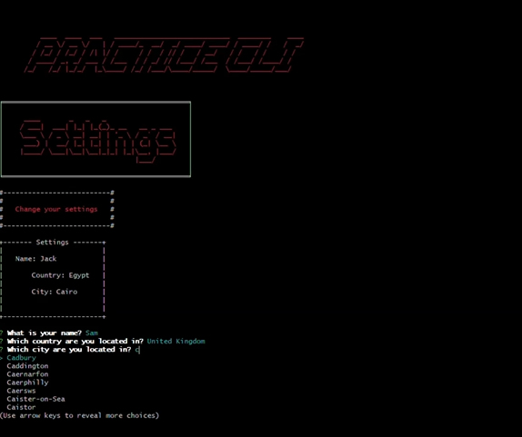

# Practice-cli

A simple CLI application to demonstrate my skills with JavaScript and TypeScript. This tool offers various interactive features to showcase my work with APIs and basic logic.

## About

I wrote this simple CLI app to demonstrate my familiarity with JavaScript/TypeScript. 

The app has the following features: 

* **Name and Location Configuration**: Set your name and location to personalize your experience with the tool.


* **Temperature Display**: Get the current temperature for your specified location via a RESTful call to the Open-meteo API.



* **Hangman Game**: Play the classic Hangman game in the terminal! You can play solo or with a friend. Guess the word before you run out of attempts.


* **Anime Information**: Retrieve details about your favorite anime using the Anilist GraphQL API. Get information like plot summaries, character details, and episode listings.


## Installation

You can run the CLI tool directly using npx.

To use the tool, run:

```sh
npx practice-cli-ditch19
```
